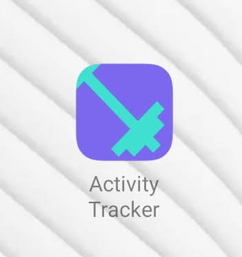
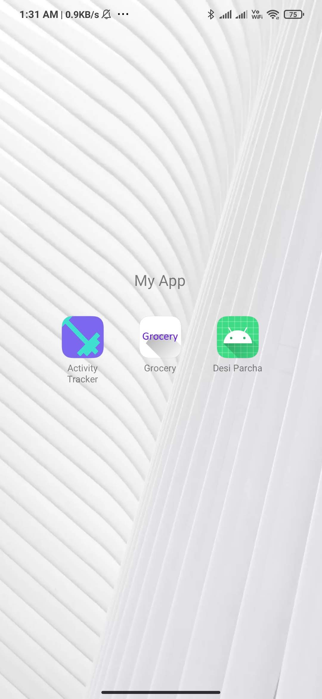
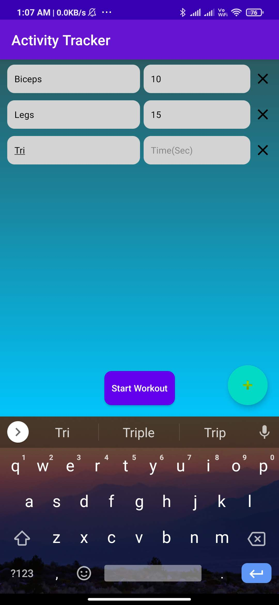
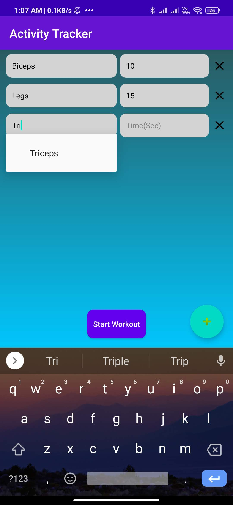
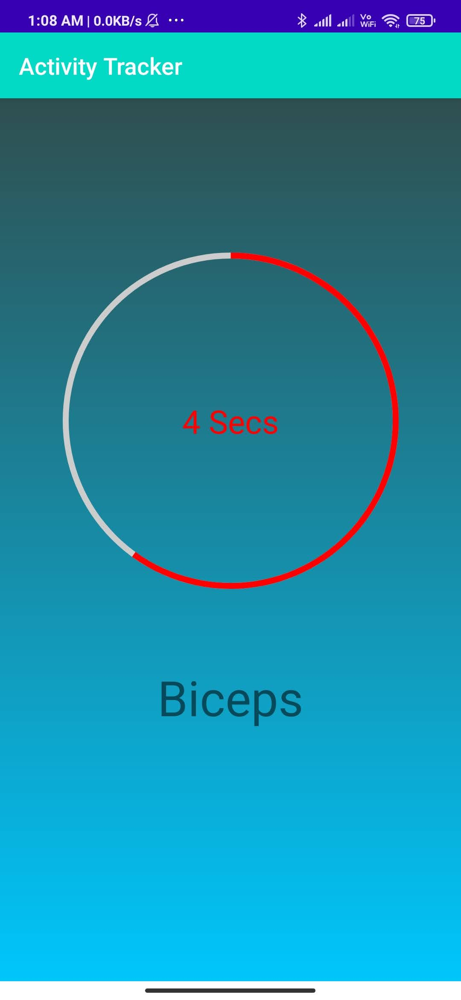
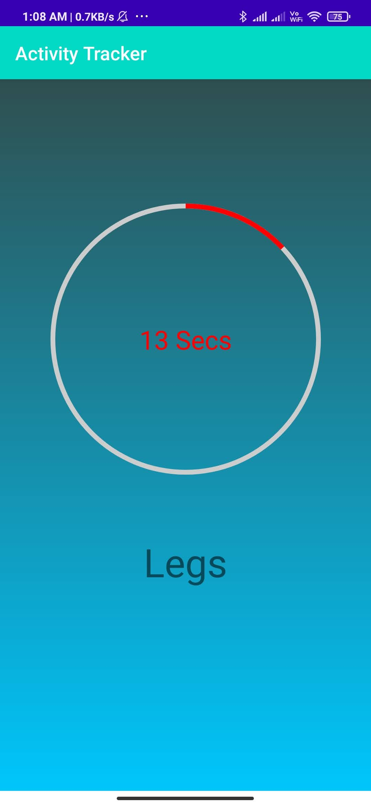
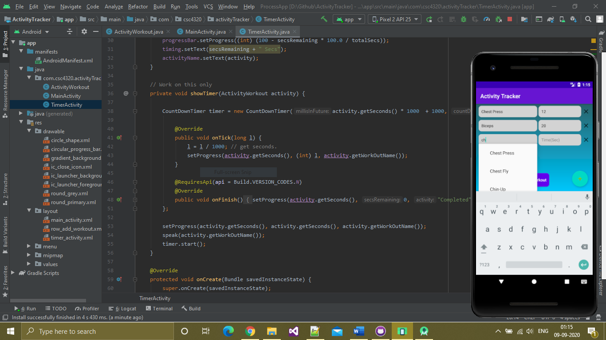

# ActivityTrackerApp
A Fitness Android Application mointor or manage your excerise time and schedule.

 
 
 

# FAQ
How to run the project?
Install Android Studio then open the project by import Project in Android Studio.

What's the minimum framework needed?
Android 7.0 and update Android Studio.
